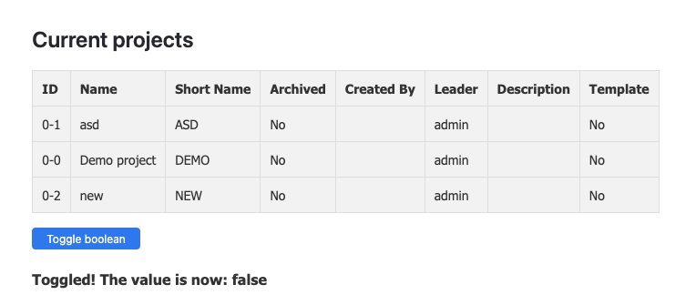

# YouTrack Widget

This project implements a YouTrack widget that displays a list of projects and provides basic interactions such as toggling a setting. It contains two implementations:

- A vanilla TypeScript implementation (see `src/widgets/sample-widget/index.ts`).
- A React-based implementation (see `src/widgets/sample-widget/app.tsx`). (With Ring UI components)

# Screenshot



## Project Structure

```
youtrack-app
├── manifest.json          # Application manifest for YouTrack
└── src
    └── widgets
        └── sample-widget
            ├── index.html         # Entry HTML file
            ├── app.tsx            # React implementation of the widget
            ├── index.ts           # Vanilla TypeScript implementation
            ├── entity.ts          # Type definitions for Project, User, and API response
            └── app.css            # Custom styling for the widget
        backend.js # HTTP Handlers
        entity-extensions.json # AppGlobalStorage
```

## Setup and Running

1. **Install Dependencies**

   In the project root directory run:

   ```bash
   npm install && npm run build
   ```

   Compress `dist` folder to .zip and upload it to YouTrack Apps.
